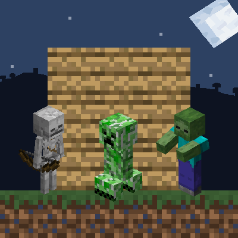

# Custom Base Raid

  

  <strong>A customizable tower-defense raid experience for Minecraft! Defend your base against relentless waves of hostile mobs.</strong>

  
  
  
  
  

---

## ⚔️ About The Mod

**Custom Base Raid** turns your base into a defensive fortress! At dusk or scheduled days, hostile mobs spawn around your bed spawn point and prepare to attack. When the hunt begins, they track you down with relentless AI. 

Survive every wave within the time limit to secure victory, earn EXP, and claim valuable rewards!

---

## 🌟 Key Features

- 🏰 **Base-Targeted Raids:** Raids spawn in a radius around your bed spawn point (or your current position if you haven't set a bed yet).
- 🌊 **Multi-Wave Assaults:** Define unlimited waves per raid, each with custom mob combinations, group counts, wave-announcement messages, and intermission countdowns.
- 🎯 **Advanced Hunt AI:** Raiders prepare during a configurable preparation window before locking onto the player and hunting them down across terrain.
- 🔮 **Glowing Aura Highlighting:** When only a few monsters remain, they glow so you don't have to wander around searching for the last hidden enemy.
- ⏱️ **Time Limits & Death Conditions:** Option to enforce strict time limits and fail the raid if you perish in battle.
- 🚫 **No Sleeping Away the Danger:** Beds cannot be used while a base raid is active!
- 🏆 **Configurable Rewards:** Award players custom quantities of EXP, item rewards, and execute custom server commands upon clearing a raid.
- 📅 **Flexible Scheduling Modes:**
  - **Scheduled:** Triggers specific custom raids on designated days (e.g. Day 3, Day 10, Day 25).
  - **Periodic:** Automatically spawns a raid every *X* days.
  - **Random:** A configurable daily percentage roll to trigger a surprise raid.
- 🎖️ **Advancement Gating:** Require players to unlock milestones (e.g. *Diamonds!*) before specific raids can occur.
- 🛠️ **In-Game Configuration GUI:** Powered by **Cloth Config**, featuring an interactive visual mob picker with search, live model previews, and instant saving.

---

## 🎮 Commands

All commands require OP / permission level 2, and support both `/custombaseraid` and the shorthand `/cbr`:

| Command | Description |
| :--- | :--- |
| `/cbr start [day]` | Starts a raid for your player (triggers the raid configured for `day`, or the default raid). |
| `/cbr stop` | Stops the active raid currently targeting you and removes spawned raiders. |
| `/cbr stopall` | Immediately terminates all active raids across the entire server. |
| `/cbr reload` | Reloads `config/custombaseraid/config.json` without restarting Minecraft. |
| `/cbr list` | Displays all configured raids, scheduled days, and wave counts. |
| `/cbr status` | Shows current raid progression, active state, and remaining monsters. |

---

## ⚙️ Configuration

The configuration file is generated automatically at `config/custombaseraid/config.json`. You can edit this file directly or configure everything in-game using the **Cloth Config** screen:

- **Fabric:** Open via [Mod Menu](https://modrinth.com/mod/modmenu).
- **NeoForge:** Open via the **Mods** menu in the game options.

### Dependencies:
- **Minecraft:** `1.21.1`
- **Fabric:** Requires [Fabric API](https://modrinth.com/mod/fabric-api) & [Cloth Config API](https://modrinth.com/mod/cloth-config). [Mod Menu](https://modrinth.com/mod/modmenu) recommended for GUI config.
- **NeoForge:** Requires [Cloth Config API](https://modrinth.com/mod/cloth-config).

---

## 📄 License

This project is licensed under the [MIT License](LICENSE).
